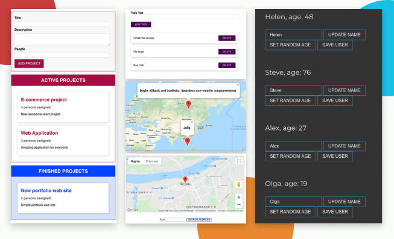

# TypeScript Projects (examples)

This project is my personal playground for TypeScript. There are several projects and code snippets that show the usage of TS in various common situations.



1. ### Basics (basics folder)

Basic syntax snippets of TypeScript. Contains basic examples of using: types and interfaces, classes, decorators, generics, type guards, intersection types, descriminated union, type casting, index properties, tuples, metadata, functions overload, optional chaining, nullish coalescing, unknown and never types.

---

2. ### Maps (maps folder and share folder)

Simple application renders 2 random points on the Google Map with random coordinates (2 different classes were used). To get random coordinates and companies I use Faker library.

The second small example - app, where you can entered the address and the google map will be rendered in the container. Created without class-based approach.

---

3. ### Sorting (sort folder)

Examples of sorting characters collection, number collection and linked list, based on the common sorting class. Class-based approach for very common case of sorting data.

---

4. ### Statistic (stats folder)

Application providing different statistic about SCV file (football matches in this example). Input and output can be easily changed.

```javascript
/** Readers */
import { MatchReader } from './MatchReader';
/** Analyzers */
import { Summary } from './Summary';
import { WinAnalysis } from './analyzers/WinsAnalysis';
import { ConsoleReport } from './reports/ConsoleReport';

// Read the file, using specific class
const reader = MatchReader.fromCsv('football.csv');
reader.load();

// Analize data
const report = new Summary(new WinAnalysis('Leicester'), new ConsoleReport());
report.buildAndPrintReport(reader.matches);

// Analize data with other conditions
const second_report = Summary.winsAnalysisWithHtml('Cardiff');
second_report.buildAndPrintReport(reader.matches);
```

---

5. ### Drag and Drop Project Manager (dragNdrop folder)

Simple class-based application, that allows to create project and drag and drop it to Active list or Finished list. There are diffrenet abstaract classes for a component and a state. State management uses a singleton concept. Uses webpack as a bundler.

6. ### Web framework (web folder)

Simple version of web framework (model, views). In this example renders the list of the users from the server and allows to edit and save their data. There are abstract classes for models (Model, Collection) and views (View, CollectionView). It's possible to create custom classes, based on abstract ones and render them into the DOM, react on changing of the models and re-render the element. Use Parcel to bundle the project.
Uses json file to store data.

```javascript
import { Collection } from './models/Collection';
import { UserList } from './views/UserList';
import { User, UserProps } from './models/User';

const users = new Collection('http://localhost:3000/users', (json: UserProps) => {
  return User.buildUser(json);
});

users.on('change', () => {
  const root = document.getElementById('root');

  if (root) {
    new UserList(root, users).render();
  }
});

users.fetch();
```

---

7. ### Express CRUD example (express folder)
   Basic express server to handle the main CRUD operations. This app uses classic way to build express apps, but with TS support. Database wasn't use, just keep all data in memory.

```javascript
export const createTodo: RequestHandler = (req, res) => {
 const text = (req.body as { text: string }).text;
 const newTodo = new Todo(Math.random().toString(), text);

 TODOS.push(newTodo);

 res.json({ message: 'Created the todo', createdTodo: newTodo });
};

```

---

8. ### Express-server (server folder)

Simple express server allows user to login in and logout. This app developed using classes and decorators. Decorators for methods (get, post, put, delete, patch), for middlewares, controller decorator for the controller class were created, then gather all different decorators applied to all methods in the class. For transferring data reflect-metadata was used. Router made using singleton.

```javascript
@controller('/auth')
class LoginController {
  @get('/login')
  getLogin(req: Request, res: Response): void {
    res.send(`Some response`);
  }

  @post('/login')
  @bodyValidator('email', 'password')
  postLogin(req: Request, res: Response): void {
    'some code here';
  }
}
```

---

9. ### Simple React ToDo with TS (react_2 folder)

Basic React Todo App, created using TypeScript template.

---

10. ### React + Redux (rrts folder)

Simple React todo-project with Redux and Thunk. Just a try with TypeScript and very basic functionality.

---

11. ### React snippets (tsreact-snippets)

Base little examples of using TS for props, state, refs, events and classes. No UI, just code snippets to have e reference.

12. ### Redux example (redux-ts)

Main goal is to use TS with Redux ecosystem.
