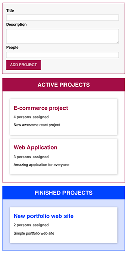
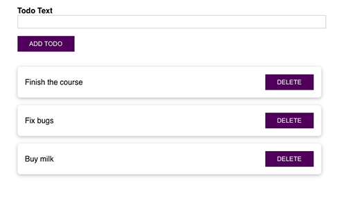

# TypeScript Projects (examples)

1. ### Basics

- Basic syntax snippets of TypeScript

2. ### Maps

- Simple application renders 2 points on the Google Map with random coordinates (2 different classes were used)

3. ### Sorting

- Examples of sorting characters collection, number collection and linked list, based on the common sorting class

4. ### Statistic

- Application providing different statistic about SCV file (football matches in this example). Input and output can be easily changed.

5. ### Drag and Drop Project Manager

- Simple class-based application, that allows to create project and drag and drop it to Active list or Finished list. There are diffrenet abstaract classes for a component and a state. State management uses a singleton concept. Uses webpack as a bundler.

6. ### Web framework

- Simple version of web framework (model, views). In this example renders the list of the users from the server and allows to edit and save their data. There are abstract classes for models (Model, Collection) and views (View, CollectionView). It's possible to create custom classes, based on abstract ones and render them into the DOM, react on changing of the models and re-render the element. Use Parcel to bundle the project.

7. ### Express-server

- Simple express server allows user to login in and logout. Developed using classes and decorators. Created decorators for methods (get, post, put, delete, patch), for middlewares, controller decorator for the controller class, that gather all different decorators applied to all methods in the class. For transferring data reflect-metadata was used. Router made using singleton.

8. ### Simple React ToDo with TS

- Basic React Todo App, created using TypeScript template.

9. ### React + Redux

- Simple React todo-project with Redux and Thunk.
